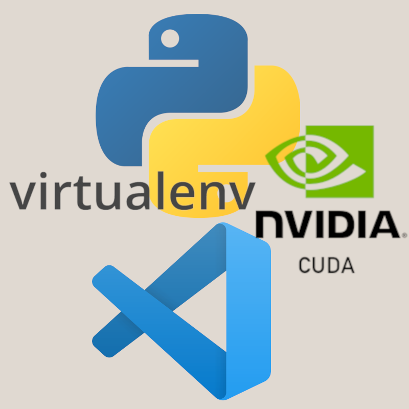
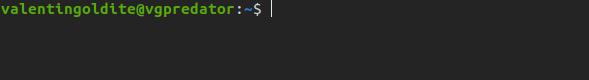
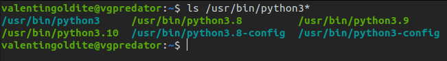
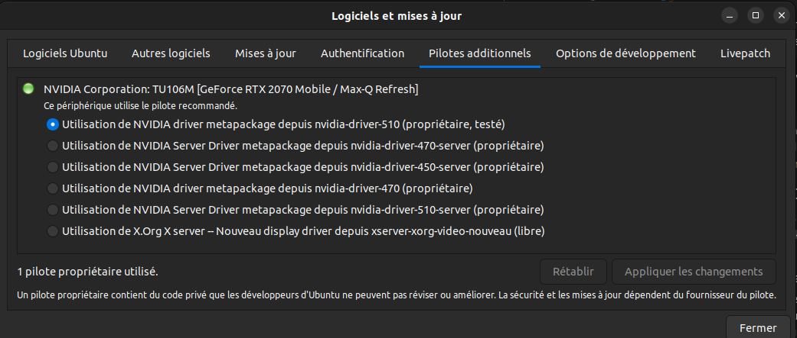
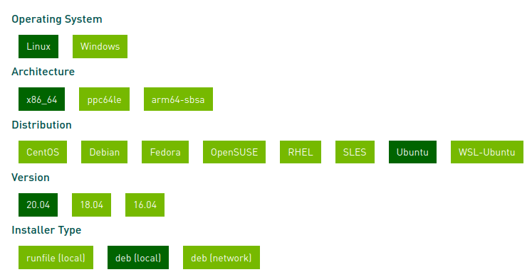
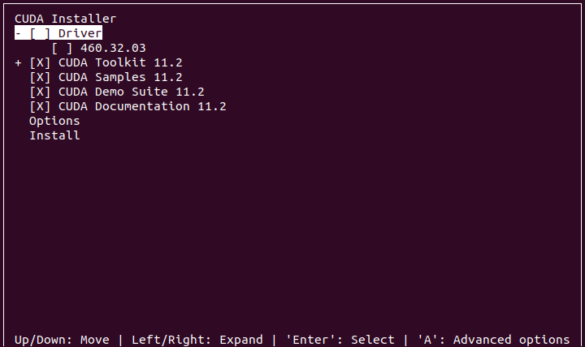
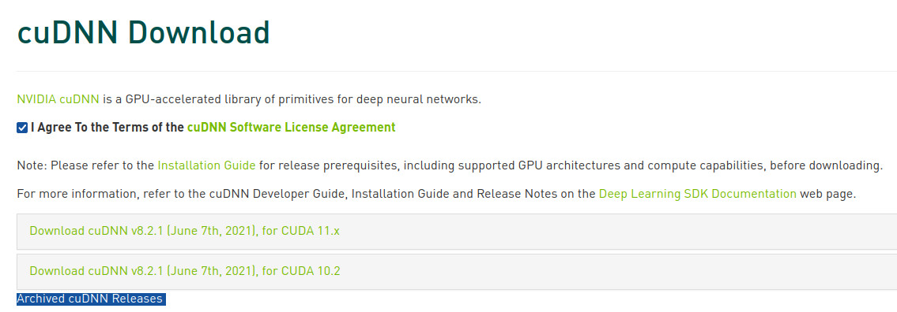
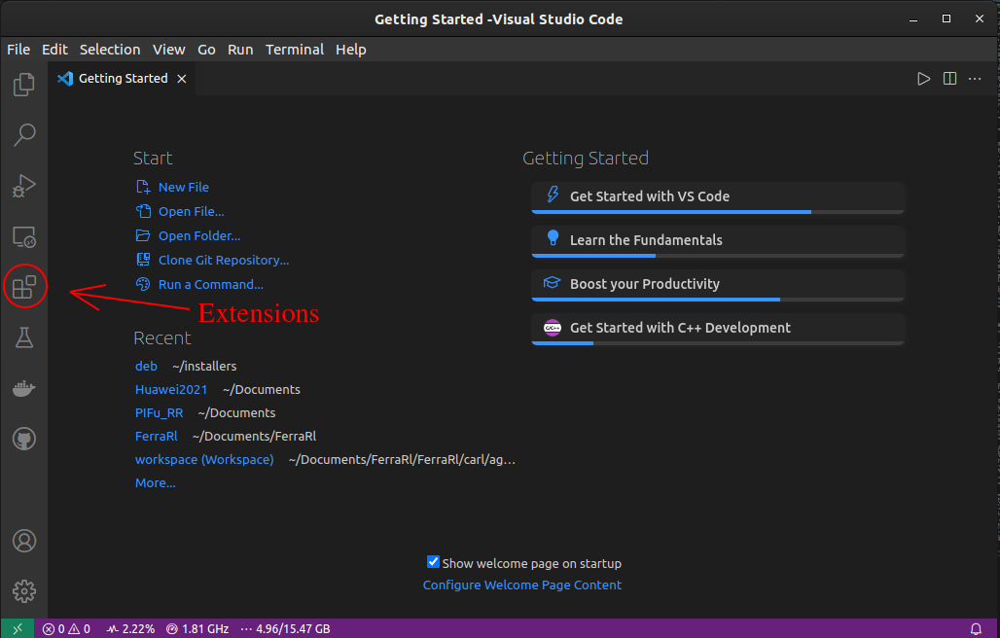
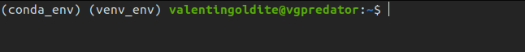

# Full Python set-up installation for Ubuntu LTS (18.04, 20.04, 22.04)

Author : Valentin Goldité ([GitHub:valentingol](https://github.com/))

Update : **April 2022**

Time: 1h30 / 2h

This tutorial is carried out as part of the IA [CentraleSupelec](https://www.centralesupelec.fr/) association: [***Les Automatants***](https://automatants.cs-campus.fr/).

This tutorial provide a step-by-step pipeline to install an effective Python set-up optimized for deep learning for Ubuntu LTS, containing libraries to use efficiently in particular the last versions of [Tensorflow](https://www.tensorflow.org/?hl=fr), [Pytorch](https://pytorch.org/) and [Jax](https://jax.readthedocs.io/en/latest/index.html) with the GPU usage and a comfortable environment of work with flexible and the highly customizable editor [VSCode](https://code.visualstudio.com/) and very convenient environment manager (and fast to use) [Virtualenv](https://pypi.org/project/virtualenv/) with its wrapper [VirtualenvWrapper](https://virtualenvwrapper.readthedocs.io/en/latest/).



You need a working **Ubuntu LTS** (22.04, 20.04 or 18.04) to run this tutorial. Then to have an access to computation on GPU using CUDA, you need a **NVIDIA GPU, a GTX 780 or newer** (more precisely, you need to have a compute capability of 3.5 or more, see the compute capability of your GPU [here](https://developer.nvidia.com/cuda-gpus#collapse4)). In case of you don't have a valid GPU, you must use your CPU instead and you can skip the CUDA and cuDNN installation steps.

## Devices and versions

The installations and corresponding versions proposed here are:

* Python 3.10
* Virtualenv & VirtualenvWrapper
* CUDA 11.2 and cuDNN 8.1 & 8.2
* VSCode
* miniconda (optional)

NOTE: **you can easily install other versions replacing the versions mentioned in this tutorial. These versions were tested in 2022, they work well together and run the current last versions of deep learning framework**.

To choose good versions of CUDA and cuDNN from a Tensorflow version, you can check this page: <https://www.tensorflow.org/install/source?hl=en#gpu>. The last version is compatible with CUDA 11.2 and cuDNN 8.1 so we are going to install these versions. Note that most of CUDA versions are compatible with last Pytorch versions (and cuDNN is not necessary for Pytorch). Finally, Jax is compatible with CUDA 11.1 or newer and cuDNN 8.2 or newer, thus we install cuDNN 8.2 as well in this tutorial (it is not required if you don't use Jax). Some combination of CUDA and cuDNN versions require building from source (complete tutorial [here](https://github.com/google/jax#installation)) but not the versions used in this tutorial.

## Before to start

All installations in this tutorial could be installed independently, the relevance of each are discussed in its dedicated session. It's recomended to install all of them, except miniconda that is optional and use to handle with conda-exclusive libraries if needed. Plus, **it's highly recommended to completely uninstall Anaconda at the beginning if it is already installed** to avoid conflicts of virtual environment and environment variables. Anaconda provided no essential features for ML and often make some unwanted changes in your computer so you can safely uninstall it forever. If you want to use Jupyter notebooks, don't worry, it will be available on VSCode too.

Then open your terminal (**Ctrl+Alt+T**). Before to begin, it's important to **leave all virtual environments** to make your installations globally.

So you should have no parenthesis with a name inside at the beginning of your line in the bash. Your bash should be similar to this (with the name of your session and your computer):



If you have parenthesis with a name on it, it means that you are in a virtual environment. You can try the following command to leave it by running `conda deactivate` if you are in a conda environment and `deactivate` if you are in virtualenv environment (try the two if you don't know the kind of environmnent you are in).

## Install Python

[**Python**](https://www.python.org/) is by far the most popular language for machine learning both in the research and professional world. The reason is that Pyhton is an intuitive and permissive language with a ton of optimized ML and processing libraries. You will to install the **3.10 version** in this tutorial but you can install all versions you want by the same way (plus versions that are in alpha/beta stage).

Now you can verify if you have already Python3.10 installed on your computer. To do this, you can display all files in `/usr/bin` whose name begin with "python":

```script
ls /usr/bin/python3*
```

(**note:** outside a virtual environment, `python` usually refers to a Python2 version while `python3` refers to the current Python3 version. Python 2 is deprecated so `python` is no longer installed by default in new machines. In all cases, always use `python3` when you are outside a virtual environment)

For example in my machine you can see that my default Python is 3.8 and I have already installed `python3.8`, `python3.9` and `python3.10`:



If `python3.10` appears, you can skip the Python installation.

If you have not Python3.10 in your computer: first add the Python PPA (Personal Package Archive) in apt to get the version you want and install Python 3.10:

```script
sudo add-apt-repository ppa:deadsnakes/ppa
sudo apt update
sudo apt install python3.10 python3.10-distutils python3.10-venv
```

Now you can verify if Python3.10 is correcly installed:

```script
ls /usr/bin/python3*
```

## Virtualenv and VirtualenvWrapper

**Virtualenv** is a util that allows you to create virtual environments, so it's a "virtual environment manager". A virtual environment install all python packages in an isolate place on your computer. You should create a virtual environment for each projects you work on, to avoid packages conflicts between your differents projects and therefore a virtual environment manager is essential for any ML developer. Virtualenv has an extension called VirtualenvWrapper that uses automatically the fonctions of Virtualenv with simple command and add some additional features easy to use. It is highly recommended to install it.

Note taht `conda` package from **Ananconda** or **Miniconda** is an other virtual environment manager and it's very popular with some people. However the drawbacks of Anaconda or Miniconda by comparison with Virtualenv are numerous and describe in the file `VIRTUALENVvsCONDA.md`.

Before to start, be aware to be outide any virtual environment.

```script
sudo apt install python3-pip
sudo pip3 install virtualenv virtualenvwrapper
```

Warning messages due to an old pip version used could occurs but you can safely ignore them.

You can get the path of `virtualenv` and of the virtualenvwrapper script `virtualenvwrapper.sh` :

```script
which virtualenv
which virtualenvwrapper.sh
```

They should be in the same directory (called **<virtualenv_dir_path>** in the following).

Now, it is time to set up VirtualenvWrapper.  To do it, VirtualenvWrapper needs you to specify some environment variables.

First create two folders. The first one `venv` will contains all environment folders and the second one `venv_hooks` will contains hooks that are some customization scripts to facilitate the use of Virtualenv:

```script
cd
mkdir venv venv_hooks
```

Now set the environment variables required at the end of the `.bashrc` file (it's a file that will be run at the start of the terminal and that already contains some environment variables):

```script
nano .bashrc
```

```nano
# virtualenvwrapper
export WORKON_HOME="$HOME/venv"
export VIRTUALENVWRAPPER_PYTHON="/usr/bin/python3"
export VIRTUALENVWRAPPER_HOOK_DIR="$HOME/venv_hooks"
source <virtualenv_dir_path>/virtualenvwrapper.sh
```

Some explanations :

* WORKON_HOME: path of the directory that contains all your upcoming environments
* VIRTUALENVWRAPPER_PYTHON: path of default python
* VIRTUALENVWRAPPER_HOOK_DIR: path of the directory that contains your hooks
* source ~/.local/bin/virtualenvwrapper.sh

In nano editor, you can save and quit your changes with : **Ctrl+X**, **Y**, **ENTER**

Now restart the bash by running: `bash`

Some line will indicate that VirtualenvWrapper has created the hooks. It happens only the first time you installed VirtualenvWrapper. You can verify if no error occurs by restarting the bash once again.

### Test VirtualenvWrapper

Now your Virtualenv is ready to use in combination with VirtualenvWrapper. You can visit the site [VirtualenvWrapper](https://virtualenvwrapper.readthedocs.io/) to see how to use the hooks and the basic command.

Some usefull command that you can already test right now:

| Command               | Effect                                                           |
| --------------------- | :--------------------------------------------------------------- |
| workon                | display all created env                                          |
| mkvirtualenv test_env | create an environment called "test_env" (and go into it)         |
| workon test_env       | go into "test_env"                                               |
| deactivate            | leave the current environment                                    |
| rmvirtualenv test_env | remove "test" (you must leave "test_env" before)                 |
| mktmpenv              | create a temporary environment (removed when left)               |
| cpvirtualenv          | copy an environment to a new environment (convenient for rename) |

To create an environment with a specific version of Python (and go directly inside it), you must precise it in argument `-p`:

```script
mkvirtualenv -p python3.10 name_of_env
deactivate
```

Note that if you have Ubuntu 22.04, the default python version is `python3.10` and so you do not have to specify "-p python3.10". Run command `python3 --version` to verify.

## CUDA and cuDNN

**WARNING** : this section deals with GPU-accelerated libraries using NVIDIA GPU. Please check *Before to start* section to verify that you have the right GPU.

### Check Driver version

First of all, you need a good version of the drivers. Open **Software and Updates (Ubuntu application)**, go in tab "Additional drivers" and select the last version of CUDA (proprietary driver). In the example below it is 510:



Then reboot your computer. Note that you must deactivate the Secure Boot first to install proprietary drivers (you can do it in the BIOS menu that is generally accessible by pressing F2 when the computer is booting).

Now the command `nvidia-smi` should return something. If it is not the case, verify that you have a correct NVIDIA GPU with Secure Boot disabled and that you are not in the Power Saving Mode (check Nvidia settings with the command `nvidia-settings`).

### Pre-installation checks

Here is the link of the official tutorial : <https://docs.nvidia.com/cuda/cuda-installation-guide-linux/index.html>. I summarize the tutorial in this section.

First verify that your machine is adapted to install CUDA:

* verify the drivers and nvidia compatibility. The following command should returns something. If not, you can verify your drivers again or check if you have a NVIDIA GPU card (`nvidia-smi` should returns something):

```script
lspci | grep -i nvidia
```

* verify your architecture. The following code should returns "x86_64", "ppc64le" or "arm64-sbsa":

```script
uname -m
```

* verify gcc and kernel version:

```script
uname -r
gcc --version
```

The versions should match the version of this grid depending on your Ubuntu version, see <https://docs.nvidia.com/cuda/cuda-installation-guide-linux/index.html#system-requirements> (versions should be the same or newer). This grid is regularly updated as new versions are released. The CUDA tutorial provides some instructions to update your kernel and compiler if needed.

### CUDA Installation

You can verify your previously installed CUDA versions (if you have ones) with this command:

```script
ls /usr/local/cuda*
```

The names of the folders are the versions already installed. If you have no folder called cuda-11.2 continue to read this section otherwise you go directly in cuDNN installation section.

**It is highly recommended to delete all unwanted versions of CUDA** by removing them in their directory:

```script
sudo rm -r /usr/local/cuda-X
```

Now it's time to install CUDA 11.2.

### On Ubuntu 18.04 or 20.04

If you have the 18.04 or the 20.04 version of Ubuntu, I advice you to install CUDA manually from archives. Find the 11.2.2 version in the CUDA archives : <https://developer.nvidia.com/cuda-toolkit-archive>. Then click on the button that corresponds to you set-up. And choose **deb (local)** option.

For exemple with a x86_64 Ubuntu 20.04:



Then follow the instruction to download CUDA. **Note**: you should  download CUDA and cuDNN files on a dedicated installation folder. To do it, create a folder in `~/` and run the commands on it.

### On Ubuntu 22.04

If you have the 22.04 version, you must install CUDA via the auto-installer. Execute the following command to get the good version of gcc (the one by default is too recent for CUDA 11.2) and get the executable:

```script
sudo apt-get install gcc-9 g++-9
sudo update-alternatives --install /usr/bin/gcc gcc /usr/bin/gcc-9 10
update-alternatives --config gcc
wget https://developer.download.nvidia.com/compute/cuda/11.2.2/local_installers/cuda_11.2.2_460.32.03_linux.run
sudo sh cuda_11.2.2_460.32.03_linux-run
```

Then, you will have a message to start the installation, click on "Continue" then write "accept" in the message box and press enter. After that, **you should NOT install the proposed drivers**. Uncheck the driver line before installing like in the picture below and click on "Install". Then ignore warning messages that suggest to change the drivers version.



Redefine your gcc version with the original one (11 by default):

``` script
sudo update-alternatives --install /usr/bin/gcc gcc /usr/bin/gcc-9 1
sudo update-alternatives --install /usr/bin/gcc gcc /usr/bin/gcc-11 2
```

### Finish installation

You can verify the cuda version in your computer with the command above. You should have a `cuda` folder and other `cuda-x` folders including at least `cuda-11.2`.

CUDA is globally a set of libraries that are generally installed as dependencies of other packages. It is possible to install some packages that are depend to CUDA and after removing it, apt could consider that CUDA are no longer necessary in your computer. And it will propose you to remove it with `apt autoremove`. But as you will use it for ML packages, you don't want to uninstall it. Therefore, you must precise to apt that you installed CUDA manually and prevent it to suggest you to remove it:

```script
sudo apt-mark manual cuda-\*
```

### cuDNN Installation

Now you will install cuDNN that contains libraries written in C used by Tensorflow and Jax. The link of the official tutorial is <https://docs.nvidia.com/deeplearning/cudnn/install-guide/index.html>. Once again, I summarize the installation below.

First go to the cuDNN page: <https://developer.nvidia.com/cudnn>. You must register an account to get access to the page so register yourself if it's the first time you try to download cuDNN. There is also a quick survey to complete or to skip. Otherwise just login in your account.

Now click on the button "Download cuDNN" and check "I agree to the terms". Some versions are proposed but they are not the versions we want. So click on "Archived cuDNN Releases"



Then choose cuDNN 8.1.1 version **that is compatible with CUDA 11.2**. And download **cuDNN Library for Linux ([your architecture])** (ex x86_64). Move the file in the folder containing the previous CUDA installation file. Open a terminal in this folder and run the following command to unpack the libraries, to copy them in cuda foder and to make them executable:

```script
tar -xzvf cudnn-<file_name>.tgz
sudo cp cuda/include/cudnn*.h /usr/local/cuda/include
sudo cp -P cuda/lib64/libcudnn* /usr/local/cuda/lib64
sudo chmod a+r /usr/local/cuda/include/cudnn*.h /usr/local/cuda/lib64/libcudnn*
```

Verify that you have some cuDNN libraries in your CUDA folder:

```script
ls /usr/local/cuda/lib64/libcudnn*
```

Now, you can do the same things to install cuDNN 8.2.2 compatible with CUDA 11.2 in order to use Jax properly. Note that it is not a problem to cumul multiple cuDNN versions in the same CUDA folder, the frameworks will automatically use the versions they need without any conflicts.

### Set environment variables

It is time to specify the path of your new libraries at the end of the `.bashrc` file:

```script
cd
nano .bashrc
```

```nano
# cuda path
export PATH="/usr/local/cuda/bin:$PATH"
export LD_LIBRARY_PATH="/usr/local/cuda/lib64:$LD_LIBRARY_PATH"
```

Now restart your bash with the command: `bash`.

### Verify GPU acceleration with Tensorflow, Pytorch and Jax

In this sub-section we will test if Tensorflow, Pytorch and Jax find the access of all libraries it needs to work with the GPU. Note that the command line to install Jax can depend on your CUDA and cuDNN configurations (see [the installation guide](https://github.com/google/jax#installation) for more details) but with the versions above, it can be with the line below.

Create a temporary environment with tensorflow, pytorch and Jax on it:

```script
mktmpenv -p python3.10
pip install -U pip
pip install tensorflow torch
pip install --upgrade "jax[cuda]" -f https://storage.googleapis.com/jax-releases/jax_releases.html
```

Tensorflow, Pytorch and Jax should be installed now. But it does not mean that they work with GPU. Run a python console and check the GPU usage. First start a Python session: `python` then run the following lines:

```python
>>> import tensorflow as tf
>>> import torch
>>> import jax
>>> torch.cuda.is_available()
True
>>> len(tf.config.list_physical_devices('GPU')) > 0
True
>>> len(jax.devices('gpu')) > 0
True
```

If all goes well, the logs of tensorflow after calling *tf.list_physical_devices("GPU")* should not return warning or error messages.

Plus, importing Jax does not result on the warning message: *No GPU found. Falling back to CPU.*

If the previous commands return `False` you have to check where is the problem. Tensorflow's logs are precious to finding the problem. Each lines begins with **I** if it is information, **W** if it is warnings and **E** or **Err** if it is error. So do take care of **W** and **E** lines (warning messages should not be ignore here as they often block the gpu usage).

The problems could be due to:

* some libraries were not found. In this case you should recheck the CUDA version and the environment variables set in `.bashrc`. If the only missing library is "cudnn", the cuDNN installation is  certainly the problem.
* mismatch version between kernel and drivers CUDA versions. In this case update the driver version to the newest could resolve the problem

Be cautious if you wan to test Tensorflow and Jax GPU computation because they allocate almost all your GPU-memory after the first operation so it will be conflict if you use them in parallel. Now you can now remove the virtual environment with: `desactivate`.

## VSCode

There are many IDE and editor for Python developement but VSCode is by far the most popular (with PyCharm). There are multiple reasons for that. First, VSCode is **usable with all existing (or almost) informatic langage**. So you can work on projects that combines fils for instance written in Python, Rust, C, C++, Markdown, Lua, Matlab... without changing your editor software! Moreover, VSCode proposes **a ton of extension to customize... basically everything**. So you can add a lot of autocomplete functions ([GitHubCopilot](https://copilot.github.com/) is the current best autocompleter par excellence), choose your favorite linter, work with interactive windows or notebooks, and so on. You also have a tab to see all files and folders on your project and switch between your different project easily. You can even set a virtual environment for each of your projects to activate automatically the good environment when you change your project. And finally, you have an **integrated terminal** so you can continue to use the terminal to work on your environment/project without changing your window. Note that VSCode extensions make it as convenient as Pycharm but with more options and more flexible.

Download the .deb file from the website : <https://code.visualstudio.com/download>. And run the following command in the folder where it's installed and launch it:

```bash
sudo apt install ./<filename>.deb
code
```

**Note**: VSCode is also in your apps now so you can launch it with **Activities > VSCode**.

Open the tab *Extension* and install *Python* extension, plus *Python Indent* and *Pylance* that are very practical for a Python developer. Reload VSCode after that and then VSCode is ready to use with Python. Now you can search for all extensions you want. You can find a lot of information about VSCode and its extensions on the Internet. Explore by yourself all the possibilities!



## Miniconda (optional)

As discussed in `VIRTUALENVvsCONDA.md`, sometimes you need to work in conda environments. It's imortant to be familiar with it, in particular because it's easy to be confuse when you are working with both conda and Virtualenv.

To have access to `conda` package you should install **miniconda**.

**Miniconda** provides the environment manager conda while **Anaconda** provides some other features in addition like **Spyder** or **Jupyter**. But in our case we have already a complete IDE and we don't want to install these useless softwares. Therefore, we only install miniconda.

### Miniconda installation

Go here: <https://docs.conda.io/en/latest/miniconda.html#linux-installers> and choose the good file depending on the Python version and the architecture you have. Normally it's **Miniconda3 Linux 64-bit**. Move the file in your installation folder and run:

```script
sh filename.sh
```

### Set up Miniconda

After the installation, your `.bashrc` is automatically modified. Miniconda could replace some of your environment variable and it's advisable to replace the lines written by conda by the following ones to introduce smaller changes:

```nano
# conda
source ~/miniconda3/etc/profile.d/conda.sh
if [[ -z ${CONDA_PREFIX+x} ]]; then
    export PATH="~/conda/bin:$PATH"
fi
```

You may have noticed that conda automatically activate the "base" environment when you start the terminal. It's very unpractical as we may only use conda maybe 5% of the time so you should deactivate this behaviour:

```script
conda config --set auto_activate_base false
```

**Important**: Now you have miniconda and Virtualenv so two environment managers that work in the same time. It could be dangerous! In particular you must avoid to be in both a conda and a virtualenv environment in the same time because you don't know what libraries will be available and where will be installed new libraries. To avoid it you must deactivate the conda or the virtualenv environment before activating a new environment with the other environment manager (`conda deactivate` or `deactivate`).

Basically what you must avoid:



In this case you should first `conda deactivate` two times (to leave "conda_env" and "base") and then `deactivate`.

This is the end of this tutorial, if you have any issue, please contact me or raise an issue in this repository. I hope it will be usefull for you!
