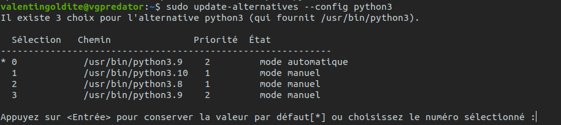

# Full Python set-up installation for Ubuntu

Author : Valentin Goldité ([GitHub:valentingol](https://github.com/))

This tutorial provide a step-by-step pipeline to install an effective Python set-up optimized for machine learning for Ubuntu. This tutorial is carried out as part of the IA [CentraleSupelec](https://www.centralesupelec.fr/) association: [***Les Automatants***](https://automatants.cs-campus.fr/).

The installations will be :

* Python 3.9
* Virtualenv/VirtualenvWrapper
* CUDA 11.2/CuDNN 8.1
* VSCode
* miniconda (optional)

All these installations could be installed independently, the relevance of each are discussed in its session. It's highly recomended to install of it, except miniconda that is optional and VSCode in case you already master PyCharm that is also a good IDE for ML developement.

**Before to begin, it is important to leave all virtual environment.**

You can do it by typing:

* if you are in a conda environment:

```bach
conda deactivate
```

* If you are in a virtualenv environment:

```bach
deactivate
```

Now, you should have no parenthesis with a name inside at the beginning of your line in the bash. Like this:


## Python

### Installation using PPA

[**Python**](https://www.python.org/) is by far the most popular language for machine learning both in the research and professional world. The reason is that **Pyhton** is an intuitive and permissive language with a ton of optimized ML and processing libraries.

We are going to install the **3.9 version** in this tutorial. It's the last version with witch **Tensorflow** and **Pytorch** (the two most popular ML framework) are compatible. Plus, we will set this version as the default version to have it automatically by default during environment creation.

First install Python using PPA (Personal Package Archive) to get the version you want (here 3.9 but you can install all the versions you want with the same method):

```bach
sudo add-apt-repository ppa:deadsnakes/ppa

```

You should update apt each time you add a ppa:

```bash
sudo apt update
```

And finally install Python:

```bash
sudo apt install python3.9
```

You can now check your current Python:

(**note:** outside a virtual environment, `python` usually refers to a Python2 version while `python3` refers to the current Python3 version. Python 2 is deprecated so `python` is often not installed by default in new machines. In all cases, always use `python3` when you are outside a virtual environment)

```bash
python3 --version
```

### Manage Python versions

You can verify if you have multiple versions of Python installed on your computer (basically, Python3.8 is often installed by default). To do this, you can display all files in `/usr/bin` whose name begin with "python":

```bash
ls /usr/bin/python3*
```

For example in my machine you can see that I have already installed `python3.8`, `python3.9` and `python3.10`:


Now you can fix manually the priority of all versions to have `python3.9` at default. For each version **X** that is not 3.9 types:

```bash
sudo update-alternatives --install /usr/bin/python3 python3 /usr/bin/python3.X 1
```

This will add `python3.X` to alternative to `python3` with priority 1. Then set a higher priority to `python3.9`:

```bash
sudo update-alternatives --install /usr/bin/python3 python3 /usr/bin/python3.9 2
```

Now you can verify the versions of Python with their priority:

```bash
sudo update-alternatives --config python3
```

In my machine (the bash is in french but you can easily verify if you have the good version by default)



Here you can manually set your default version but as we have already fix the priority for each version, 3.9 is now the default version and you can just press ENTER.

In the future, you can change the default version in the same way by changing the priorities.

## Virtualenv and VirtualenvWrapper
