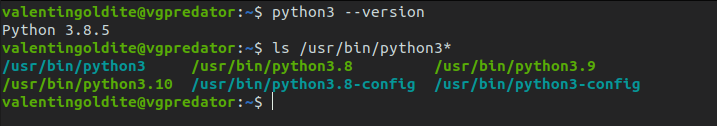
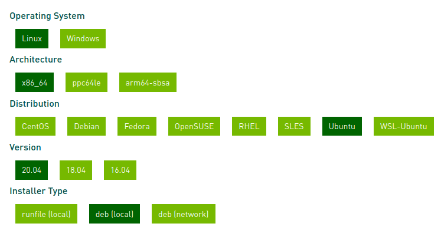
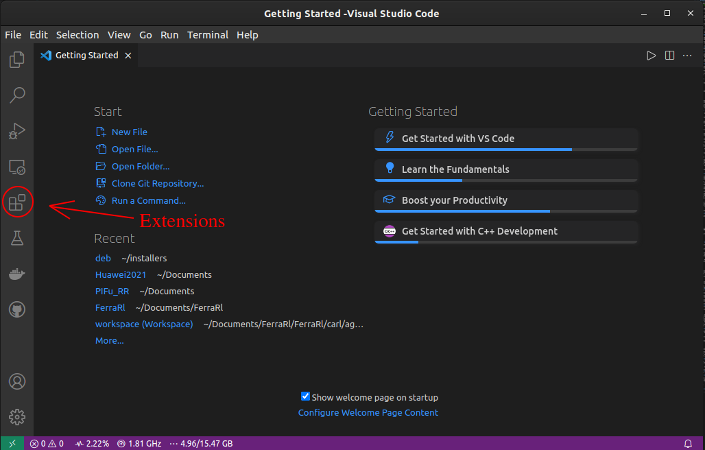

# Full ML Python set-up installation for Ubuntu (20.04, 18.04 or 16.04)

Author : Valentin Goldité ([GitHub:valentingol](https://github.com/))

Date : 06/2021

This tutorial provide a step-by-step pipeline to install an effective Python set-up optimized for machine learning for Ubuntu LTS, containing libraries to use efficiently the last versions of [Tensorflow](https://www.tensorflow.org/?hl=fr) and [Pytorch](https://pytorch.org/) with the GPU and a comfortable environment of work with flexible and highly customizable IDE ([VSCode](https://code.visualstudio.com/)) and environment manager ([Virtualenv](https://pypi.org/project/virtualenv/)/[VirtualenvWrapper](https://virtualenvwrapper.readthedocs.io/en/latest/)).

This tutorial is carried out as part of the IA [CentraleSupelec](https://www.centralesupelec.fr/) association: [***Les Automatants***](https://automatants.cs-campus.fr/) (France).

The installations and corresponding versions proposed here are:

* Python 3.9
* Virtualenv/VirtualenvWrapper
* CUDA 11.2/CuDNN 8.1
* VSCode
* miniconda (optional)

**Note**: It's advisable to install and use the last versions of Python, CUDA and CuDNN that work with the last versions of Tensorflow and Pytorch. These versions above works well with **Tensorflow 2.15** and **Pytorch 1.9** that are the last version when this article is written. If there are new versions of Tensorflow and Pytorch when you are reading these lines, you can check on the Internet the versions of Python, CUDA and CuDNN compatible with. **You can easily install all versions you need by replacing the versions mentioned in this tutorial**. For Tensorflow you can check the compatible versions in here : <https://www.tensorflow.org/install/source#gpu> (but if it's not always update with the last versions of tensorflow). For Pytorch, you can install inside the environment the CUDA version you want but for compatibility with other libraries that use the GPU it's better to avoid installing it. Fortunately, the versions of Pytorch work with numerous versions of CUDA and does not require CuDNN. So you can choose the CUDA/CuDNN versions regarding the compatibility with Tensorflow only.

An other possibility is to install Python 3.9, CUDA 11.2 and CuDNN 8.1 following this tutorial and to install tensorflow==2.15 and torch==1.9 specifying the versions to install them in your environment. Notice that the versions of Tensorflow and Pytorch are globally compatible which each other so it's rarely a problem to install old versions.

All installations in this tutorial could be installed independently, the relevance of each are discussed in its dedicated session. It's highly recomended to install all of it, except miniconda that is optional and VSCode in case you already master the use of [PyCharm](https://www.jetbrains.com/fr-fr/pycharm/) that is also a good IDE for ML developement.

**It's highly recommended to completely uninstall Anaconda at the beginning** to avoid conflicts of virtual environment and environment variables. Anaconda provided no essential features for ML and often make some unwanted changes in your computer so you can safely uninstall it forever. You can make a backup of your important conda environment to reintegrate them after the miniconda installation. For more information, please read the Miniconda section.

Open your terminal (**Ctrl+Alt+T**). Before to begin, it's important to **leave all virtual environments** to make your installations globally.

So you should have no parenthesis with a name inside at the beginning of your line in the bash. Like this:


If you have parenthesis with a name on it, it means that you are in a virtual environment. You can try the following command to leave it:

* if you are in a conda environment:

```bach
conda deactivate
```

* If you are in a virtualenv environment:

```bach
deactivate
```

## Python

### Installation using PPA

[**Python**](https://www.python.org/) is by far the most popular language for machine learning both in the research and professional world. The reason is that Pyhton is an intuitive and permissive language with a ton of optimized ML and processing libraries. You will to install the **3.9 version** in this tutorial but you can install all versions you want by the same way (in particular versions that are in alpha/beta stage).

You can now check your current Python by default:

(**note:** outside a virtual environment, `python` usually refers to a Python2 version while `python3` refers to the current Python3 version. Python 2 is deprecated so `python` is no longer installed by default in new machines. In all cases, always use `python3` when you are outside a virtual environment)

```bash
python3 --version
```

The returned version is your default version of Python. It's not always Python 3.9 even if you install it. It's possible to change the default version to 3.9 but it's dangerous because some applications need a specific version to works and changing the default version could break them. In the next session you will see how set the Pyhton version during environment creation so keep in mind for the following if your Python by default is 3.9 or not.

Now you can verify if you have already Python3.9 installed on your computer. To do this, you can display all files in `/usr/bin` whose name begin with "python":

```bash
ls /usr/bin/python3*
```

For example in my machine you can see that my default Python is 3.8 and I have already installed `python3.8`, `python3.9` and `python3.10`:



If `python3.9` appears, you can skip the Python installation.

If you have not Python3.9 in your computer: first add the Python PPA (Personal Package Archive) in apt to get the version you want:

```bach
sudo add-apt-repository ppa:deadsnakes/ppa

```

You have to update apt now (and in general each time you add a PPA):

```bash
sudo apt update
```

And finally install Python 3.9:

```bash
sudo apt install python3.9
```

Now you can verify if Python3.9 is correcly installed:

```bash
ls /usr/bin/python3*
```

## Virtualenv and VirtualenvWrapper

### Virtualenv vs Conda

**Virtualenv** is a util that allows you to create virtual environments, so it's an "virtual environment manager". The virtual environments install all python packages in an isolate place on your computer. You should create a virtual environment for each projects you work on, to avoid packages conflicts between your differents projetcs and therefore a virtual environment manager is essential for any ML developer.

The `conda` package from **Ananconda** or **Miniconda** is an other virtual environment manager and it's very popular with some people. However the drawbacks of Anaconda or Miniconda by comparison with Virtualenv are numerous:

* Virtualenv only use `pip` for installation where Ananconda use both `conda` and `pip` that could lead to package conflicts depending on the installation method
* `conda` has difficulties to fix versions conflicts. The pipeline of `pip` is more efficient and it search dirctly versions that match all dependencies
* most developer use only `pip` on their projects so you almost always only use `pip` even with Ananconda (basically when you install packages with: `pip install -r requirements.txt`)
* `conda` has a weird environment architecture. You have a "base" environment automatically activated (at the start of the bash!) and all other environment are inside it.
* `conda` has a bad organization of directories and sripts. Each time you create a `conda` environment, a tons of configuration scripts and heavy folders are installed. Only two light folders are installed with Virtualenv: one for the python package and one for binary files (contaning in particular the interpreters)
* Virtualenv has an extension called VirtualenvWrapper that will allows you to have a lot of commands to facilitate the environment management and it will be more convenient that conda even for switching or creating environment (where conda is already easy to use)
* Virtualenv environments are fully compatible with environments created by `venv` command (but more practical to use).

The only problem of Virtualenv is that some rare packages are only available with `conda-forge` and so you must work in conda environment if you want them for a project. That's why I'll explain how to install conda further. The problems of conda are not sufficient to prevent you from using it quite efficiently sometimes so don't worry about that. **But in when you have the choice always privilege using Virtualenv.**

### Virtualenv/VirtualenvWrapper installation

Be aware of to be outside all virtual environment.

```bash
sudo apt install python3-pip
sudo pip3 install virtualenv virtualenvwrapper
```

Warning messages due to the pip version could occurs but you can safely ignore them.

You can get the path of `virtualenv` and of the virtualenvwrapper script `virtualenvwrapper.sh` :

```bash
which virtualenv
which virtualenvwrapper.sh
```

They should be in the same directory (called **<virtualenv_dir_path>** in the following).

Now, it is time to set up VirtualenvWrapper. VirtualenvWrapper is an extension of Virtualenv that uses automatically the fonctions of Virtualenv and add some additional features. To do it, VirtualenvWrapper needs you to specify some environment variables.

First create two folders. The first one `venv` will contains all environment folders and the second one `venv_hooks` will contains hooks that are some customization scripts to facilitate the use of Virtualenv:

```bash
cd ~
mkdir venv venv_hooks
```

Now set the environment variables required at the end of the `.bashrc` file (it's a file that will be run at the start of the terminal and that already contains some environment variables):

```bash
nano .bashrc
```

```nano
# virtualenvwrapper
export WORKON_HOME="$HOME/venv"
export VIRTUALENVWRAPPER_PYTHON="/usr/bin/python3"
export VIRTUALENVWRAPPER_HOOK_DIR="$HOME/venv_hooks"
source <virtualenv_dir_path>/virtualenvwrapper.sh
```

Some explanations :

* WORKON_HOME: path of the directory that contains all your upcoming environments
* VIRTUALENVWRAPPER_PYTHON: path of default python
* VIRTUALENVWRAPPER_HOOK_DIR: path of the directory that contains your hooks
* source ~/.local/bin/virtualenvwrapper.sh

In nano editor, you can save and quit your changes with : **Ctrl+X Y ENTER**

Now restart the bash:

```bash
bash
```

Some line will indicate that VirtualenvWrapper has created the hooks. It happens only the first time you installed VirtualenvWrapper. You can verify if no error occurs by restarting the bash once again.

### Test VirtualenvWrapper

Now your Virtualenv is ready to use in combination with VirtualenvWrapper. You can visit the site [VirtualenvWrapper](https://virtualenvwrapper.readthedocs.io/) to see how to use the hooks and the basic command.

Some usefull command that you can already test right now:

| Command               | Effect                                                   |
| --------------------- | :------------------------------------------------------: |
| workon                | display all created env                                  |
| mkvirtualenv test_env | create an environment called "test_env" (and go into it) |
| workon test_env       | go into "test_env"                                       |
| deactivate            | leave the current environment                            |
| rmvirtualenv test_env | remove "test" (you must leave "test_env" before)         |
| mktmpenv              | create a temporary environment (removed when left)       |

To create an environment with a specific version of Python, you must precise it in argument `-p`:

```bash
mkvirtualenv -p python3.9 tuto
```

If 3.9 is your default version of Python, you do not have to specify "-p python3.9".

## CUDA and CuDNN

**WARNING** : this section deals with GPU-accelerated libraries using NVIDIA GPU. **You must have a NVIDIA GPU card** to apply the installations on this section.

In machine learning it's very usefull to make calculation accelerated by GPU. That is why you should install cuda libraries to use your GPU if you have a NVDIA GPU and it's the goal of this section.

It's also very important to install the good versions that match exactly the requirements of the ML framework you use. **Tensorflow 2.15** and **Pytorch 1.9** are compatible with **CUDA 11.2.x and CuDNN 8.1.x** so we will install these versions.

### Check Driver version

First of all, you need a good version of the drivers. Open **Software and Updates**, go in tab "Additional drivers" and select the version 460 (proprietary driver). Then reboot your computer. Verify that your driver version are >= 460.27.03 to be compatible with CUDA 11.2.2.

**Note** : you must **deactivate Secure Boot** via the **BIOS** if it's installed. Otherwise it's impossible to active proprietary drivers.

### Pre-installation checks

Here is the link of the official tutorial : <https://docs.nvidia.com/cuda/cuda-installation-guide-linux/index.html>. I summarize the tutorial in this section.

First verify that your machine is adapted to install CUDA:

* verify the drivers and nvidia compatibility. The following command should returns something. If not, you can verify your drivers again or check if you have a NVIDIA GPU card (`nvidia-smi` should returns something):

```bash
lspci | grep -i nvidia
```

* verify architecture. The following code should returns "x86_64"

```bash
uname -m
```

* verify gcc and kernel version:

```bash
uname -r
gcc --version
```

The versions should match the version of this grid depending on your Ubuntu version:


I fyou have a problem with one of these requirements, you can find more information on the tutorial <https://docs.nvidia.com/cuda/cuda-installation-guide-linux/index.html>. Otherwise, you can start the installation of CUDA and CuDNN library in the next section.

### CUDA 11.2.2 installation

You can verify your previously installed CUDA versions (if you have ones) with this command:

```bash
ls /usr/local/cuda*
```

The names of the folders are the versions already installed. If you have no folder called cuda-11.2 continue to read this section otherwise you go directly in CuDNN installation section.

You can delete all unwanted versions of CUDA by removing them in their directory:

```bash
sudo rm -r /usr/local/cuda-X
```

Now it's time to install CUDA. Find the 11.2.2 version in the CUDA archives : <https://developer.nvidia.com/cuda-toolkit-archive>. Then click on the button that corresponds to you set-up. And choose **deb (local)** option.

For exemple with a x86_64 Ubuntu 20.04:



Then follow the instruction to download CUDA. **Note**: you should  download CUDA and CuDNN files on a dedicated folder. To do it, create a folder in `~/` and run the commands on it.

You can verify the cuda version in your computer:

```bash
ls /usr/local/cuda*
```

You should have a `cuda` folder and other `cuda-x` folders including at least `cuda-11.2`.

CUDA is globally a set of libraries that are generally installed as dependencies of other packages. It is possible to install some packages that are depend to CUDA and after removing it, apt could consider that CUDA are no longer necessary in your computer. And it will propose you to remove it with `apt autoremove`. But as you will use it for ML packages, you don't want to uninstall it. Therefore, you must precise to apt that you installed CUDA manually and prevent it to suggest you to remove it:

```bash
sudo apt-mark manual cuda-\*
```

### Installation CuDNN 8.1.1

Now you will install CuDNN that contains libraries written in C used by Tensorflow. The link of the official tutorial is <https://docs.nvidia.com/deeplearning/cudnn/install-guide/index.html>. Once again, I summarize the installation below.

First go to the CuDNN page: <https://developer.nvidia.com/cudnn>. You must register an account to get access to the page so register yourself if it's the first time you try to download CuDNN. There is also a quick survey to complete or to skip. Otherwise just login in your account.

Now click on the button "Download CuDNN" and check "I agree to the terms". Some versions are proposed but they are not the versions we want. So click on "Archived cuDNN Releases"


Then choose CuDNN 8.1.1 version **that is compatible with CUDA 11.2**. And download **cuDNN Library for Linux (x86_64)**. Move the file in the folder containing the previous CUDA installation file. Open a terminal in this folder and run the following command to unpack the libraries, to copy them in cuda foder and to make them executable:

```bash
tar -xzvf cudnn-<file_name>.tgz
sudo cp cuda/include/cudnn*.h /usr/local/cuda/include
sudo cp -P cuda/lib64/libcudnn* /usr/local/cuda/lib64
sudo chmod a+r /usr/local/cuda/include/cudnn*.h /usr/local/cuda/lib64/libcudnn*
```

If you loose your libraries, you can now install them kickly with the files saved in your installation folder.

### Set environment variables

Now you must specify the path of your new libraries at the end of the `.bashrc` file:

```bash
cd ~
nano .bashrc
```

```nano
# cuda path
export PATH="/usr/local/cuda/bin:$PATH"
export LD_LIBRARY_PATH="/usr/local/cuda/lib64:$LD_LIBRARY_PATH"
```

Now restart your bash:

```bash
bash
```

### Verify GPU acceleration with Tensorflow and Pytorch

In this sub-section we will test if Tensorflow and Pytorch find the access of all libraries it needs to work with the GPU.

1st step - create a temporary environment with tensorflow on it:

```bash
mktmpenv -p python3.9
pip install -U pip
pip install tensorflow torch
```

Tensorflow and Pytorch should be installed now. But it does not mean that they work with GPU. Run a python console and check the GPU usage:

```bash
python3
```

```python
>>>> import tensorflow as tf
>>>> import tensorflow as tf
>>>> torch.cuda.is_available()
True
>>>> len(tf.list_physical_devices("GPU")) >= 1
True
```

The two last lines should returns `True` if your libraries are set correcly (*tf.list_physical_devices("GPU")* returns the list of all GPU available by Tensorflow).

If the previous commands return `False` you have to check where is the problem. Tensorflow's logs are precious to finding the problem. Each lines begins with **I** if it is information, **W** if it is warnings and **E** or **Err** if it is error. So do take care of **W** and **E** lines (warnings will lock your GPU use like errors so don't ignore them).

The problems could be due to:

* some libraries were not found. In this case you should recheck the CUDA version and the environment variables set in `.bashrc`. If the only missing library is "cudnn", the CuDNN installation is  certainly the problem.
* mismatch version between kernel and drivers CUDA versions. In this case changing the driver version to match the kernel CUDA version could resolve the problem

If all goes well, the logs of tensorflow after calling *tf.list_physical_devices("GPU")* should be like:


All lines are information (start with **I**) and the output is a non-empty list.

## VSCode

There are many IDE for Python developement but VSCode is by far the most popular (with PyCharm). There are multiple reasons for that. First, VSCode is **usable with all existing (or almost) informatic langage**. So you can work on projects that combines for example Python, Rust, C, Lua, Matlab... files without changing your IDE! Moreover, VSCode proposes **a ton of extension to customize... basically everything**. So you can add a lot of autocomplete functions, choose your favorite linter, work with interactive windows or notebooks, and so on. You also have a tab to see all files and folders on your project and switch between your different project easily. You can even set a virtual environment for each of your projects to activate automatically the good environment when you change your project. And finally, you have an **integrated terminal** so you can continue to use the terminal to work on your environment/project without changing your window.

### VSCode installation

Download the .deb file from the website : <https://code.visualstudio.com/download>. And run the following command in the folder where it's installed:

```bash
sudo apt install ./<filename>.deb
```

Then launch VSCode using :

```bash
code
```

**Note**: VSCode is also in your apps now so you can launch it with **Activities > VSCode**.

Open the tab *Extension* and install *Python* extension, plus *Python Indent* and *Pylance* that are very practical for a Python developer. Reload VSCode after that and then VSCode is ready to use with Python. Now you can search for all extensions you want. You can find a lot of information about VSCode and its extensions on the Internet. Explore by yourself all the possibilities!



## Miniconda (optional)

As discussed in the Virtualenv section, sometimes you need to work in conda environments. It's imortant to be familiar with it, in particular because it's easy to be confuse when you are working with both conda and Virtualenv.

To have access to `conda` package you should install **miniconda**.

**Miniconda** provides the environment manager conda while **Anaconda** provides some other features in addition like **Spyder** or **Jupyter**. But in our case we have already a good IDE and we don't want to install useless software. Therefore, we only install miniconda.

### Miniconda installation

Go here: <https://docs.conda.io/en/latest/miniconda.html#linux-installers> and choose the good file depending on the Python version and the architecture you have. Normally it's **Miniconda3 Linux 64-bit**. Move the file in your installation folder and run:

```bash
sh filename.sh
```

### Set up Miniconda

After the installation, your .bashrc is automatically modified. Miniconda could replace some of your environment variable so it's advisable to replace the lines written by conda by:

```nano
# conda
source ~/miniconda3/etc/profile.d/conda.sh
if [[ -z ${CONDA_PREFIX+x} ]]; then
    export PATH="~/conda/bin:$PATH"
fi
```

You may have noticed that conda automatically activate the "base" environment when you start the terminal. It's very unpractical as we may only use conda maybe 5% of the time so you should deactivate this behaviour:

```bash
conda config --set auto_activate_base false
```

**Important**: Now you have miniconda and Virtualenv so two environment managers that work in the same time. It could be dangerous! In particular you must avoid to be in both a conda and a virtualenv environment in the same time because you don't know what libraries will be available and where will be installed new libraries. To avoid it you must deactivate the conda or the virtualenv environment before activating a new environment with the other environment manager (`conda deactivate` or `deactivate`).

Basically what you must avoid:


In this case you should first `conda deactivate` two times (to leave "conda_env" and "base") and then `deactivate`.
