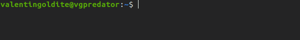

# Full Python set-up installation for Ubuntu (20.04, 18.04 or 16.04)

Author : Valentin Goldité ([GitHub:valentingol](https://github.com/))

Date : 06/2021

This tutorial provide a step-by-step pipeline to install an effective Python set-up optimized for machine learning for Ubuntu. This tutorial is carried out as part of the IA [CentraleSupelec](https://www.centralesupelec.fr/) association: [***Les Automatants***](https://automatants.cs-campus.fr/).

The installations will be :

* Python 3.9
* Virtualenv/VirtualenvWrapper
* CUDA 11.2/CuDNN 8.1
* VSCode
* miniconda (optional)

All these installations could be installed independently, the relevance of each are discussed in its session. It's highly recomended to install of it, except miniconda that is optional and VSCode in case you already master PyCharm that is also a good IDE for ML developement.

**Before to begin, it's important to leave all virtual environment.**

You can do it by typing:

* if you are in a conda environment:

```bach
conda deactivate
```

* If you are in a virtualenv environment:

```bach
deactivate
```

Now, you should have no parenthesis with a name inside at the beginning of your line in the bash. Like this:



## Python

### Installation using PPA

[**Python**](https://www.python.org/) is by far the most popular language for machine learning both in the research and professional world. The reason is that **Pyhton** is an intuitive and permissive language with a ton of optimized ML and processing libraries.

We are going to install the **3.9 version** in this tutorial. It's the last version with witch **Tensorflow** and **Pytorch** (the two most popular ML framework) are compatible. Plus, we will set this version as the default version to have it automatically by default during environment creation.

First install Python using PPA (Personal Package Archive) to get the version you want (here 3.9 but you can install all the versions you want with the same method):

```bach
sudo add-apt-repository ppa:deadsnakes/ppa

```

You should update apt each time you add a ppa:

```bash
sudo apt update
```

And finally install Python:

```bash
sudo apt install python3.9
```

### Manage Python versions

You can now check your current Python:

(**note:** outside a virtual environment, `python` usually refers to a Python2 version while `python3` refers to the current Python3 version. Python 2 is deprecated so `python` is often not installed by default in new machines. In all cases, always use `python3` when you are outside a virtual environment)

```bash
python3 --version
```

The returned version is your default version of Python. It's possible to change the default version to 3.9 but it's dangerous because some other applications need a specific version to works and changing the default version could break them.

You can verify if you have multiple versions of Python installed on your computer (basically, Python3.8 is often installed by default). To do this, you can display all files in `/usr/bin` whose name begin with "python":

```bash
ls /usr/bin/python3*
```

For example in my machine you can see that my default Python is 3.8 and I have already installed `python3.8`, `python3.9` and `python3.10`:


In the next session you will see how set the Pyhton version during environment creation.

## Virtualenv and VirtualenvWrapper

### Virtualenv or Conda

**Virtualenv** is a util that allows you to create virtual environment. Virtual environments install all packages in an isolate place on the computer. You should create a viertual environment for each projects you work on to avoid packages conflicts between your differents projetcs and so **Virtualenv** is essential for a ML developer.

The `conda` package from **Ananconda** or **miniconda** is an other virtuel environment manager and it's very popular with some people. However the drawbacks of `conda` by comparison with virtualenv are numerous:

* Virtualenv only use `pip` for installation where Ananconda use both `conda` and `pip` that could lead to package conflicts depending on the installation method
* `conda` has difficulties to fix versions conflicts. The pipeline of `pip` is more efficient and it search automatically versions that match all dependencies
* most developer use only `pip` so you almost always only use `pip` even with Ananconda
* `conda` has a weird environment architecture because you have a "base" environment automatically activated (at the start of the bash!) and all other environment are inside it
* `conda` has a bad organization of folder and sripts. Each time you create a `conda` environment, a tons of configuration scripts and heavy folders are installed. With Virtualenv only two light folders are installed: one for the python package and one for binary files (with interpreter on it)
* Virtualenv has an extension VirtualenvWrapper that will allows you to have a lot of commands to facilitate the environment management and it will be more convenient that conda even for switching or creating environment (where conda is already easy to use)
* Virtualenv environment are fully compatible with environment created by `venv` command (but more practical to use).

The only problem of Virtualenv is that some rare packages are only available with `conda-forge` and so you must work in conda environment if you want them for a project. That's why I'll explain how to install conda further. The problems of conda are not sufficient to prevent you from using it quite efficiently sometimes so don't worry about that. **But in when you have the choice, always privilege Virtualenv.**

### Virtualenv/VirtualenvWrapper installation

Be aware of to be outside all virtual environment.

```bash
sudo pip3 install virtualenv virtualenvwrapper
```

You can get the path of `virtualenv` and the virtualenvwrapper script `virtualenvwrapper.sh` :

```bash
which virtualenv
which virtualenvwrapper.sh
```

They should be in the same folder (called **<virtualenv_folder_path>** in the following).

Now, it is time to set-up VirtualenvWrapper. Is an extension of Virtualenv that uses automatically the fonctions of Virtualenv and add some additional functionalities. But to do it, VirtualenvWrapper needs you to specify some environment variables.

First create two folders. The first one `venv` will contains all environment folders and `venv_hooks` will contains hooks that are some customization scripts to facilitate the use of Virtualenv:

```bash
cd ~
mkdir venv venv_hooks
```

Now set the environment variables required at the end of the `.bashrc` file (it's a file that will be run at the start of a bash and that already contains some environment variables):

```bash
nano .bashrc
```

```nano
# virtualenvwrapper
export WORKON_HOME="$HOME/venv"
export VIRTUALENVWRAPPER_PYTHON="/usr/bin/python3"
export VIRTUALENVWRAPPER_HOOK_DIR="$HOME/venv_hooks"
source <virtualenv_folder_path>/virtualenvwrapper.sh
```

Some explanations :

* WORKON_HOME: path of the folder that contains all your upcoming environments
* VIRTUALENVWRAPPER_PYTHON: path of default python
* VIRTUALENVWRAPPER_HOOK_DIR: path of the folder that contains your hooks
* source ~/.local/bin/virtualenvwrapper.sh

In nano editor, you can save and quit your changes with : **Ctrl+X  Y ENTER**

### Test VirtualenvWrapper

Now your Virtualenv is ready to use in combination with VirtualenvWrapper. You can visit the site [VirtualenvWrapper](https://virtualenvwrapper.readthedocs.io/) to see how to use the hooks and the basic command.

Some usefull command that you can already test:

| Command           | Effect |
| ----------        | :-------------: |
| workon            | display all created env |
| mkvirtualenv test | create an environment called "test" (and go into) |
| workon test       | go into "test" |
| deactivate        | leave the current environment |
| rmvirtualenv test | delete "test" |
| mktmpenv          | create a temporary environment (removed when left) |

To create an environment with a specific version of Python, you must precise it in argument `-p`:

```bash
mkvirtualenv -p python3.9 tuto
```

## CUDA and CuDNN

**WARNING** : this section deals with GPU-accelerated libraries using NVIDIA GPU. **You must have a NVIDIA GPU card** to apply the installations on this section.

In machine learning it's very usefull to make calculation accelerated by GPU. That's why you should install cuda libraries to use your GPU if you have a NVDIA GPU and it's the goal of this section.

It's also very important to install the good versions that match exactly the requirements of the ML framework you use. **Tensorflow 2.15** and **Pytorch 1.9** are compatible with **CUDA 11.2.x and CuDNN 8.1.x** so we will install these versions. To check what if the versions compatible with a version of Tensorflow you can check this link : <https://www.tensorflow.org/install/source#gpu> even if it's not always update with the last versions of tensorflow. For Pytorch, you can visit the dedicated website: <https://pytorch.org/> to know how install it.

### Check Driver version

First of all, you need a good version of the drivers. Open **Software and Updates**, go in tab "Additional drivers" and select the version 460 (proprietary driver). Then reboot your computer. Verify that your driver version are >=460.27.03

**Note** : you must deactivate Secure Boot via the BIOS if it's installed. Otherwise it's impossible to active proprietary drivers.

### Pre-installation checks

Here is the link of the official tutorial : <https://docs.nvidia.com/cuda/cuda-installation-guide-linux/index.html>. I make a summary here and provide a usefull link to get the archives:

First verify that your machine is adapted to install CUDA:

* verify the drivers and nvidia compatibility. The following command should returns something. If not you can verify you driver again or check if you have a NVIDIA GPU card (`nvidia-smi` should returns something):

```bash
lspci | grep -i nvidia
```

* verify architecture. The following code should returns "x86_64"

```bash
uname -m
```

* verify gcc and kernel version:

```bash
uname -r
gcc --version
```

The versions should match the version of this grid depending on your Ubuntu version:


I fyou have a problem with one of these requirements, you can find more information on the tutorial <https://docs.nvidia.com/cuda/cuda-installation-guide-linux/index.html>. Otherwise, you can start the installation of CUDA and CuDNN library.

### CUDA 11.2.2 installation

Find the 11.2.2 version in the CUDA archives : <https://developer.nvidia.com/cuda-toolkit-archive>. Then click on the button that corresponds to you set-up. And choose **deb (local)** option.

 For exemple with a x86_64 Ubuntu 20.04:


Then follow the instruction to download CUDA. **Note**: you should  download CUDA and CuDNN files on a dedicated folder. To do it, create a folder and run the commands on it.

You can verify the cuda version in your computer:

```bash
ls /usr/local/cuda*
```

You should have a `cuda/` folder and other `cuda-x` folders including at least `cuda-11.2`.

### Installation CuDNN 8.1.1

Now you will install CuDNN that contains libraries in C used by Tensorflow. The link of the official tutorial is <https://docs.nvidia.com/deeplearning/cudnn/install-guide/index.html>. Once again, I summarize the installation below.

First go to the CuDNN page: <https://developer.nvidia.com/cudnn>. You must register an account to get access to the page so register yourself if it's the first time you try to download CuDNN. Otherwise just login in your account.

Now click on the button "Download CuDNN" and agree to the terms. Some versions are proposed but they are not the versions we want. So click on "Archived cuDNN Releases"


Then choose CuDNN 8.1.1 version **that is compatible with CUDA 11.2**. And download **cuDNN Library for Linux (x86_64)**. Move the file in the folder containing the previous cuda file installer. Open a terminal in this folder and run the following command to unpack the libraries, to copy them in cuda foder and to make them executable:

```bash
tar -xzvf cudnn-<file_name>.tgz
sudo cp cuda/include/cudnn*.h /usr/local/cuda/include
sudo cp -P cuda/lib64/libcudnn* /usr/local/cuda/lib64
sudo chmod a+r /usr/local/cuda/include/cudnn*.h /usr/local/cuda/lib64/libcudnn*
```

### Set environment variables

Now you must specify the path of your new libraries at the end of the `.bashrc` file:

```bash
cd ~
nano .bashrc
```

```nano
# cuda path
export PATH="/usr/local/cuda/bin:$PATH"
export LD_LIBRARY_PATH="/usr/local/cuda/lib64:$LD_LIBRARY_PATH"
```

### Verify GPU acceleration with Tensorflow

In this sub-section we will test if Tensorflow find the access of all libraries it needs to work with the GPU.

1st step - create a temporary environment with tensorflow on it:

```bash
mktmpenv -p python3.9
pip install -U pip
pip install tensorflow
```

Tensorflow 2.5.0 should be installed now. But it doesn't mean that it works with GPU. Run a python console and check the GPU with Tensorflow:

```bash
python3
```

```python
import tensorflow as tf
print(len(tf.list_physical_devices("GPU")) >= 1)
```

Should returns `True`.

"*tf.list_physical_devices("GPU")*" returns the list of all GPU available by Tensorflow.

If the previous command returns `False` you have to check where is the problem. Each lines of Tensorflow logs begin with "I" if there are information, "W" if they are warnings and "E" or "Err" if they are error. So take care of "W" and "E" lines.

The problems could be due to:

* mismatch version between kernel and cuda version of driver. In this case changing the driver version should resolve the problem
* some libraries were not found. In this case you should recheck the CUDA version and the environment variables set in `.bashrc`. If the only missing library is "cudnn", the CuDNN installation is  certainly the problem.

## VSCode

There are many IDE for Python developement but VSCode is by far the most popular (with PyCharm). There are multiple reasons for that. First, VSCode is usable with all existing (or almost) informatic langage. So you can work on projects that combining Python, Rust, C, Lua, Matlab... files without changing your IDE! Moreover, VSCode proposes a ton of extension to customize... basically everything. So you can add a lot of autocomplete functions, choose your favorite linter, work with interactive windows or notebooks, and so on. You also have a tab to see all files and folders on your project and switch between your different project easily. You can even set a virtual environment for each of your projects to activate automatically the good environment when you change your project. And finally, you have an integrated terminal so you can continue to use the terminal to work on your environment/project without changing your window.

### VSCode installation

Download the .deb file from the website : <https://code.visualstudio.com/download>. And run the following command in the folder where it's installed:

```bash
sudo apt install ./<filename>.deb
```

Then launch VSCode using :

```bash
code
```

**Note**: VSCode is also in your apps now so you can launch it with **Activities > VSCode**

Open the tab *Extension* and install *Python* extension, *Python Indent* and *Pylance*. Reload VSCode after that and then you can search for all applications you want! You can find a lot of information about VSCode in general and its extension on the Internet. Please explore by yourself all the possibilities!

## Miniconda (optional)

Now you can install miniconda to have access to conda package. The inconvenient of conda by comparison with Virtualenv are already discussed in a previous section but sometimes you need to work in conda environment and it's imortant to be familiar with it, in particular because it's easy to be confuse when you are working with both conda and Virtualenv.

Miniconda provides the environment manager conda while Anaconda provides some other features in addition like Spyder or Jupyter. But in our case we have already a good IDE and we don't want to install useless software so we only install Miniconda.

### Miniconda installation

Go here: <https://docs.conda.io/en/latest/miniconda.html#linux-installers> and choose the good file depending on the Python version and the architecture you have. Normally it's **Miniconda3 Linux 64-bit**. Move the file in your installation folder and run:

```bash
sh filename.sh
```

### Set up Miniconda

After the installation, your .bashrc is automatically modified. Miniconda could replace some of your environment variable so it's adviced to replace the line written by conda by:

```nano
# conda
source ~/miniconda3/etc/profile.d/conda.sh
if [[ -z ${CONDA_PREFIX+x} ]]; then
    export PATH="~/conda/bin:$PATH"
fi
```

You may have noticed that conda automatically activate an environment when you start the terminal. It's very unpractical as we may only use conda 5% of the time so you should deactivate this behaviour:

```bash
conda config --set auto_activate_base false
```

**Important**: Now you have Miniconda and Virtualenv, two environment manager that works in the same time. It could be dangerous! In particular you must avoid to be in a conda environment and a viertualenv environment in the same time. So if you have two words in parenthesis at the beginning of your bash line, you must deactivate conda or virtualenv (`conda deactivate` or `deactivate`).
